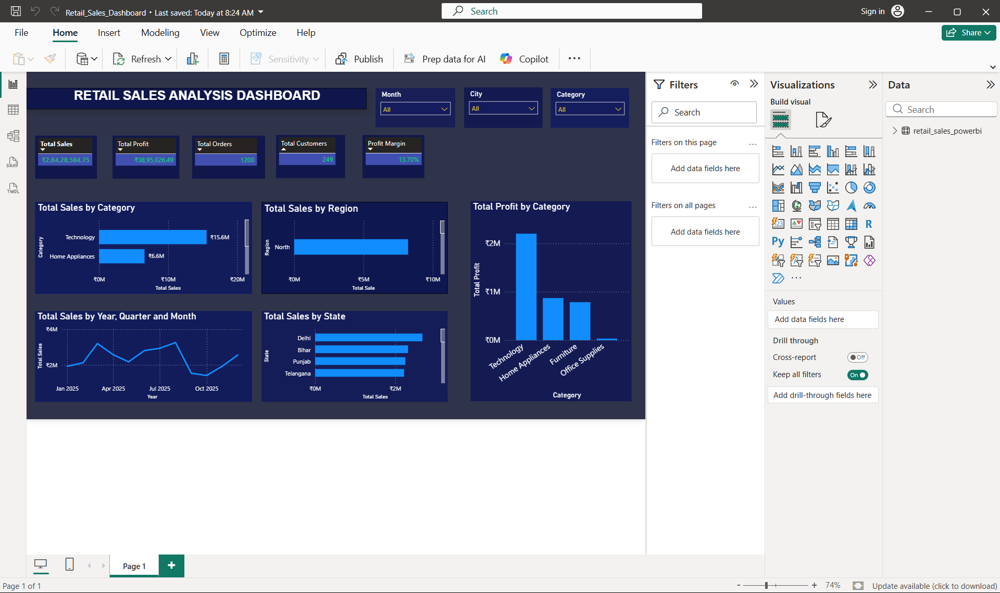

# Retail Sales Analysis Dashboard

## Project Overview

This project is an interactive Retail Sales Analysis Dashboard developed using Microsoft Power BI.

The dashboard analyzes retail sales data and provides insights into sales, profit, customers, orders, regions, states, categories, and monthly sales trends.

## Dashboard



## Key Performance Indicators

- Total Sales: ₹2,84,28,584.75
- Total Profit: ₹38,95,026.49
- Total Orders: 1,200
- Total Customers: 249
- Profit Margin: 13.70%

## Dashboard Features

- Total Sales by Category
- Total Sales by Region
- Total Profit by Category
- Total Sales by State
- Monthly Sales Trend
- Interactive Month filter
- Interactive City filter
- Interactive Category filter

## Tools & Technologies

- Microsoft Power BI
- DAX
- CSV
- Data Analysis
- Data Visualization

## DAX Measures

```DAX
Total Sales = SUM(retail_sales_powerbi[Sales])

Total Profit = SUM(retail_sales_powerbi[Profit])

Total Orders = DISTINCTCOUNT(retail_sales_powerbi[Order_ID])

Total Customers = DISTINCTCOUNT(retail_sales_powerbi[Customer_ID])

Profit Margin = DIVIDE([Total Profit], [Total Sales], 0)